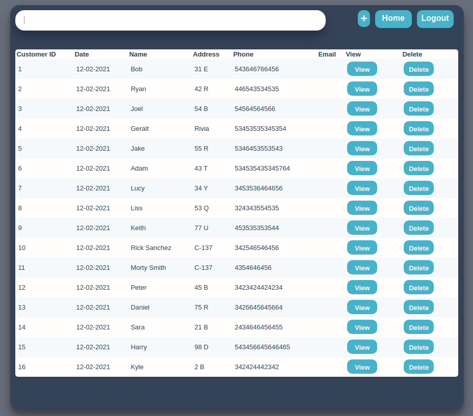

[![Forks][forks-shield]][forks-url]
[![Stargazers][stars-shield]][stars-url]
[](https://github.com/Adam-94/Devstats/blob/master/LICENSE)


<!-- PROJECT LOGO -->
<br />
<p align="center">
  <a href="https://github.com/adam-94/dash_demo"></a>
  <h2>Project Currently Archived</h2>
  <h3 align="center">Dash Demo</h3>

  <p align="center">
    Dash Demo is a simple web application to keep track of your customers and orders.
    <br />
    <br />
    This is a similar version of an application that was developed for a company. Some changes have been made to be able to showcase the application and allow for previewing 
    <br />
    <br />
    <strong>Login: demo</strong>
    <br />
    <strong>Password: demo</strong>
    <br />
    <a href="https://dash-demo2.herokuapp.com/login">Live Demo</a>
    ·
    <a href="https://github.com/adam-94/dash_demo/issues">Report Bug</a>
    ·
    <a href="https://github.com/adam-94/dash_demo/issues">Request Feature</a>
  </p>
</p>

## Table of Contents

* [About the Project](#about-the-project)
    * [Installation](#commands)
* [Built With](#built-with)
* [Contributing](#contributing)
* [License](#license)

<!-- ABOUT THE PROJECT -->
## About The Project


As stated before this is a simple web application for keeping track of customers and their orders. This was originally developed for a company, but this version has seen changes to allow for the demo.

## Installation

1. Clone repository
```
git clone https://github.com/Adam-94/dash_demo.git
```
**Ubuntu 20.04**

1. Install virtual environment
```
sudo apt install -y python3-venv
```

2. Create virtual environment
```
python3 -m venv env
```

3. Activate virtual environment
```
source env/bin/activate
```

4. Install requirements
```
pip3 install -r requirements.txt
```

5. Set environment Variables
```
export SECRET_KEY="reallysecretkey"
export SQLALCHEMY_DATABASE_URI="sqlite:///site.db"
```

6. Run
```
python3 run.py
```

### Windows

1. Install virtual environment
```
pip install virutalenv
```

2. Create virtual environment
```
virutalenv env
```

3. Activate virtual environment
```
env\Scripts\activate
```

4. Install requirements
```
pip Install -r requirements.txt
```

5. Set environment Variables
```
set SECRET_KEY="reallysecretkey"
set SQLALCHEMY_DATABASE_URI="sqlite:///site.db"
```

6. Run
```
python3 run.py
```

### Built With
* [Python](https://www.python.org/)
* [Flask](https://flask.palletsprojects.com/en/1.1.x/)
* [SQLAlchemy](https://www.sqlalchemy.org/)

<!-- LICENSE -->
## License

Distributed under the MIT License. See `LICENSE` for more information.


<!-- MARKDOWN LINKS & IMAGES -->
<!-- https://www.markdownguide.org/basic-syntax/#reference-style-links -->
[forks-shield]: https://img.shields.io/github/forks/adam-94/dash_demo.svg?style=flat-square
[forks-url]: https://github.com/adam-94/dash_demo/network/members
[stars-shield]: https://img.shields.io/github/stars/adam-94/dash_demo.svg?style=flat-square
[stars-url]: https://github.com/adam-94/dash_demo/stargazers
[issues-shield]: https://img.shields.io/github/issues/adam-94/dash_demo.svg?style=flat-square
[issues-url]: https://github.com/adam-94/dash_demo/issues
